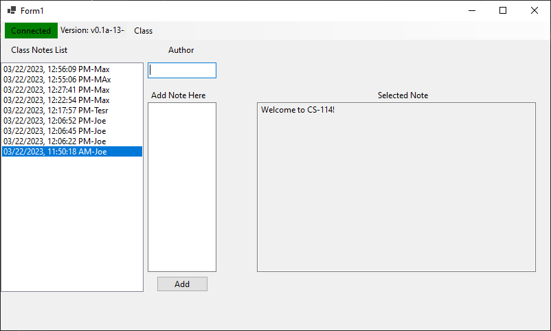

Getting Started
===============

Introduction
------------

Welcome to SNUB! The SNHU User Database.

SNUB is an open and accessible user database, it allows anybody
at SNHU to add comments, notes and more to specific classes or events!

Installing the SNUB Client
--------------------------

To get started using SNUB, navigate to our `releases`_ page.

Download the latest ``ClientApp.zip`` file and extract it to find the ``.exe`` inside.

.. _releases: https://github.com/KenwoodFox/SNUB/releases
