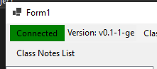
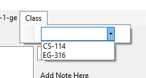
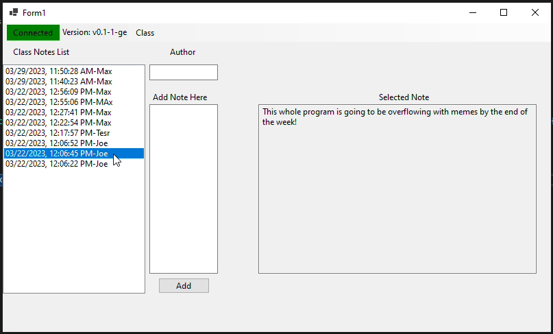

Using SNUB
==========

.. warning::
    SNUB is experimental and inescure software, do not rely on SNUB for migration
    or important data at this stage!

After installing the client software on your computer, press ``Connect`` to get started.

Using the dropdown, select a class.

Once you select a class, a list of notes should populate the left side, ordered by date.

Select any note to view its content, you're using SNUB!
